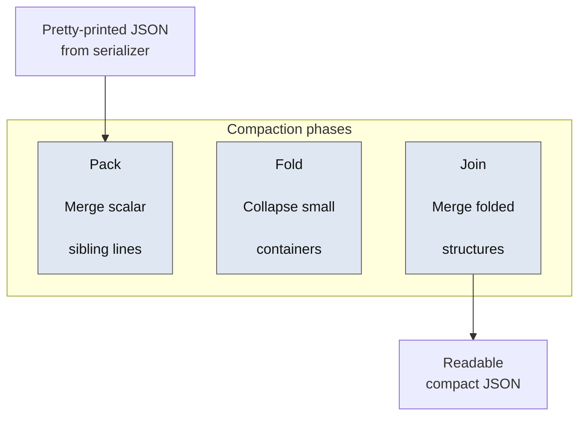

```mermaid
flowchart TB

    classDef phase fill:#dfe7f2,stroke:#666,color:#111

    A["Pretty-printed JSON<br/>from serializer"]

    subgraph phases["Compaction phases"]
        direction LR

        B["Pack<br/>
        Merge scalar<br/>
        sibling lines"]

        C["Fold<br/>
        Collapse small<br/>
        containers"]

        D["Join<br/>
        Merge folded<br/>
        structures"]
    end

    E["Readable<br/>compact JSON"]

    A --> B
    D --> E
    class B,C,D phase

```