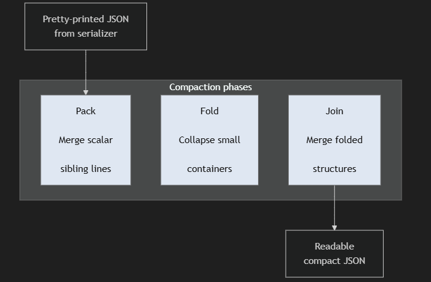

<!-- cSpell:words jsonfold isinstance rapidjson TTFB kwargs fopencookie funopen  -->
<!-- LTeX: dictionary+=jsonfold dictionary+=serializer dictionary+=serializers dictionary+=Serializers -->

# A Streaming JSON Formatter for JavaScript that Works with JSON.stringify

Built-in JSON serializers give us two choices:

The default output is built for machines and optimized for efficiency. It is compact, without any extra whitespace. While technically "text", it feels "binary" - a dense wall of brackets, quotes, commas, and braces that is painful to inspect.

```json
{"request_id":"8f2c1a44-91e2-4f52-8e11-7d2d1d9d52d1","timestamp":"2026-05-19T14:32:11Z","user":{"id":10421,"name":"John Smith","roles":["admin","reviewer","ops"],"preferences":{"theme":"dark","notifications":{"email":true,"sms":false,"push":true}}},"jobs":[{"id":901,"status":"running","targets":["srv-a01","srv-a02","srv-a03"],"metrics":{"cpu":72.4,"mem":68.1,"latency_ms":[12,15,11,18,14]}},{"id":902,"status":"queued","targets":["srv-b17"],"metrics":{"cpu":0,"mem":0,"latency_ms":[]}}],"audit":{"created_by":"system","created_at":"2026-05-19T14:00:00Z","tags":["prod","finance","daily-run","priority-high"]}}
```

To solve this problem many serializers provide a "Pretty-print" mode, which adds indentation, spacing around tokens and line breaks - making it readable for humans. The problem is that for large documents it often goes too far: A small array of numbers becomes ten lines. A tiny metadata object becomes a block. Deep structures become readable only by making the file much longer.

That extra formatting is not free. It makes logs larger, diffs noisier, terminal output harder to scan, and requires "speed-scrolling" to review the data sets.

What I wanted was a middle ground: JSON that keeps the shape of pretty-printed output, but folds small, simple structures back onto one line when they fit.

This article describes `jsonfold`, a process for "compacting" pretty-print JSON data to make it more readable for humans. The level of "compactness" is controlled by parameters, and there are a few preset configurations that can be used to get output with minimal effort.

# `jsonfold` in 2 minutes

> Get fine control over the pretty-print JSON output. Keep it machine-readable and human-friendly.
> 
> jsonfold works with existing serializers rather than replacing them. 

Project Website: https://jsonfold.dev. The website includes an interactive formatter and the GeoJSON example used throughout this article.

Repository: https://github.com/yairlenga/jsonfold

JavaScript implementation is under `javascript` directory: (jsonfold.js)

Install from NPM:
```shell
npm install @jsonfold/core
```
or copy jsonfold.js directly from the [GitHub project](https://raw.githubusercontent.com/yairlenga/jsonfold/refs/heads/main/articles/02-javascript/jsonfold.js) 

## Minimal Usage


```javascript
import * as jsonfold from "@jsonfold/core"

const data = {
    "meta": {"version": 1, "ok": true},
    "ids": [1, 2, 3, 4, 5],
    "items": [{"id": 1, "name": "alpha"}, {"id": 2, "name": "beta"}],
}

// Use default setting
console.log(jsonfold.stringify(data))

// Use custom setting
console.log(jsonfold.stringify(data, null, { compact: "high", indent: 4 }))
```


## Different levels of compaction

```json
// compact=low
{
  "a": {
    "b": { "c": "abc" }
  },
  "x": {
    "y": { "z": "xyz" }
  }
}

// Compact=default
{
  "a": { "b": { "c": "abc" } },
  "x": { "y": { "z": "xyz" } }
}

// Compact=max
{ "a": { "b": { "c": "abc" } }, "x": { "y": { "z": "xyz" } } }
```

### `jsonfold` on real data.

Using the geojson file [geojson.xyz: admin 1 states provinces](https://geojson.xyz/). You can view the actual output. Measurements below were taken with a maximum line width of 120 columns and indent=2.

* [Minified](https://raw.githubusercontent.com/yairlenga/jsonfold/refs/heads/main/articles/01-python/geojson.json)
  130K, 1 line, 130,429 columns, Readability Index: 0.64
* [Baseline, Pretty-Printed](https://raw.githubusercontent.com/yairlenga/jsonfold/refs/heads/main/articles/01-python/geojson-none.json):
  285K, 11731 lines, 79 columns, Readability Index: 1.00
* [jsonfold compact=low](https://raw.githubusercontent.com/yairlenga/jsonfold/refs/heads/main/articles/01-python/geojson-low.json):
  167K, 2344 lines, 120 columns, Readability Index: 16.0
* [jsonfold compact=default](https://raw.githubusercontent.com/yairlenga/jsonfold/refs/heads/main/articles/01-python/geojson-default.json):
  167K, 2344 lines, 120 columns, Readability Index: 16.0
* [jsonfold compact=high](https://raw.githubusercontent.com/yairlenga/jsonfold/refs/heads/main/articles/01-python/geojson-high.json):
  166K, 2239 lines, 120 columns, Readability Index: 18.0
* [jsonfold compact=max](https://raw.githubusercontent.com/yairlenga/jsonfold/refs/heads/main/articles/01-python/geojson-max.json):
  156K, 1321 lines, 255 columns, Readability Index: 24.0

The "Readability Index" value is a **non-scientific** measure to estimate how suitable the output is for human inspection. It is calculated by assigning visual complexity to the output.
> **Visual complexity** =  
> &nbsp;&nbsp;&nbsp;&nbsp;lines X max_width X max (lines, max_width)
>
> **Readability Index** =  
> &nbsp;&nbsp;&nbsp;&nbsp;Complexity(pretty_printed) / Complexity(document)
>

Higher visual complexity values are assigned to outputs that are either very wide or require excessive  scrolling. The Readability Index is the inverse of visual complexity, normalized so that conventional pretty-printed JSON has a score of 1.0.

The data tells us:
- The **minified** is space efficient, but essentially unreadable (without tools).
- The **Pretty-printed version** generates a readable document, but increases the output size by 2.2X.
- **`jsonfold`**: improves the Readability Index by 16-24X, while retaining most of the space benefits.

You can try the same example interactively at https://jsonfold.dev. The site uses the same JavaScript `jsonfold` library and includes a GeoJSON sample.

# Key ideas

## Do not replace the serializer

For my implementation, I chose NOT to build another serializer. There are already many good serializers available in multiple languages. Many of them support custom transformations, special handling for application classes, non-standard numeric values, date/time objects, and other data types. For example:

- JavaScript's [`JSON.stringify()`](https://developer.mozilla.org/en-US/docs/Web/JavaScript/Reference/Global_Objects/JSON/stringify) supports a `replacer` function that can alter the stringification process.

- The Python [json module - JSON encoder and decoder](https://docs.python.org/3/library/json.html) provides options for custom data types, `NaN` handling, custom encoders, and more.

- [Java Jackson ](https://github.com/fasterxml/jackson) `ObjectMapper` can perform complex transformation of POJOs based on annotations, introspection and templates.

## Why not build a complete JSON serializer?

We already have good JavaScript serializers that handle:
- Filtering and transformation (via replacer)
- Application specific transformation with toJSON methods
- Serialization for built-in and special values.

`jsonfold` focuses only on formatting the generated JSON data.

## Wrap the output stream

Instead of replacing or extending the serializer, `jsonfold` acts as a filter between the serializer and the final output stream.

The serializer still does what it already knows how to do: convert application data into valid JSON text. `jsonfold` only looks at the generated pretty-printed output and decides which parts can be safely folded back onto one line.

This keeps all the existing serializer functionality and customization in place.

## Operate on pretty-printed token stream

The `jsonfold` does not reparse the JSON format or reconstruct the data objects. Instead, it operates directly on the pretty-printed token stream generated by the serializer. It relies on a few assumptions:

1. The input is valid JSON.
2. Each input line represents an atomic JSON fragment that can be safely moved or merged as a unit, and should NOT be split or reformatted.
3. Indentation provides structural clues about the relationship between elements.

If the above assumptions are violated, the `jsonfold` falls back into "raw" mode - where the data is passed through unchanged, without attempting any unsafe transformation.

# The three phases

The compaction is done in three logical phases, we will name them: **pack**, **fold** and **join**. Each one performs a specific transformation that makes the JSON easier to read (by removing whitespace), while not changing the data itself. Separating the process into phases makes the implementation simpler and more predictable. Each phase operates on progressively more compact structures while preserving the original JSON semantics. All three phases are incremental, and process the stream as data becomes available.



## Pack
The **pack** phase handles merging of scalar items inside containers (array, object). It will "pack" array items and object properties that belong to the same containers into single line, subject to specific width, and limits. Basically:

```json
// From            To:
[                  [
    "1",
    "2",      ->      "1", "2", "3"
    "3"
]                  ]

{                  {
    "a": 1,
    "b": 2,   ->      "a": 1, "b": 2, "c": 3
    "c": 3
}                  }
```

Example:

```json
{
    "summary": {
        "source": "wikipedia"
    },
    "meta": {
        "generated": "2026-03-13"
    },
    "by_land": [
        "RUS",
        // 4 more entries
        "AUS"
    ],
    "by_population": [
        "IND",
        "CHN",
        // 16 Additional entries
        "DEU",
        "TZA"
    ],
    "name": {
        "RUS": "Russia",
        "CAN": "Canada",
        "CHN": "China",
        "USA": "United States",
        "BRA": "Brazil",
        "AUS": "Australia"
    }
}
```
to:
```json
{
  "summary": { "source": "wikipedia" },
  "meta": { "generated": "2026-03-13" },
  "by_land": [
    "RUS", "CAN", "CHN", "USA", "BRA", "AUS"
  ],
  "by_population": [
    "IND", "CHN", "USA", "IDN", "PAK", "NGA", "BRA", "BGD", "RUS",
    "ETH", "MEX", "JPN", "EGY", "PHL", "COD", "VNM", "IRN", "TUR",
    "DEU", "TZA"
  ],
  "name": {
    "RUS": "Russia", "CAN": "Canada", "CHN": "China",
    "USA": "United States", "BRA": "Brazil", "AUS": "Australia"
  }
}
```

More technically: The first phase looks for lines with the same indentation level, and will merge consecutive lines in such a way that it will respect the user provided line width. In addition, it is possible to cap the count of lines that will be packed for arrays and for objects.

## Fold

The **Fold** phase handles merging of containers that have only one line of items with the container opener/closer (For arrays: `[` and `]`, for objects: `{`, `}`), subject to specific width, nesting level and item counts. Basically:

```json
// List Folding: From 3 lines 
[
    "1", "2", "3"
]
//     To: single line
[ "1", "2", "3" ]

// Object Folding: From 3 lines:
{
    "a": 1, "b": 2, "c": 3
}
//     To: single line
{ "a": 1, "b": 2, "c": 3 }

```
Continuing with the above example, the attributes 'by_land' and 'summary' are not shown in a single line.

```json
{
  "summary": { "source": "wikipedia" },
  "meta": { "generated": "2026-03-13" },
  "by_land": [ "RUS", "CAN", "CHN", "USA", "BRA", "AUS" ],
  "by_population": [
    "IND", "CHN", "USA", "IDN", "PAK", "NGA", "BRA", "BGD",
    "RUS", "ETH", "MEX", "JPN", "EGY", "PHL", "COD", "VNM",
    "IRN", "TUR", "DEU", "TZA"
  ],
  "name": {
    "RUS": "Russia", "CAN": "Canada", "CHN": "China", "USA": "United States",
    "BRA": "Brazil", "AUS": "Australia"
  }
}
```

## Join

The **join** phase is similar to the **pack** phase - it will attempt to merge folded lines together, potentially merging folded objects into the same line, subject to specific width, nesting level and item counts.

At this stage, previously folded containers are treated as atomic units that can be merged together while preserving their internal structure. This allows nested structures such as coordinate pairs or small embedded objects to behave similarly to scalar values during compaction.

Continuing with the above example, the attributes 'summary' and 'meta' are now merged into a single line.
```json
{
  // summary and meta merge into a single line.  
  "summary": { "source": "wikipedia" }, "meta": { "generated": "2026-03-13" },
  "by_land": [ "RUS", "CAN", "CHN", "USA", "BRA", "AUS" ],
  "by_population": [
    "IND", "CHN", "USA", "IDN", "PAK", "NGA", "BRA", "BGD",
    "RUS", "ETH", "MEX", "JPN", "EGY", "PHL", "COD", "VNM",
    "IRN", "TUR", "DEU", "TZA"
  ],
  "name": {
    "RUS": "Russia", "CAN": "Canada", "CHN": "China", "USA": "United States",
    "BRA": "Brazil", "AUS": "Australia"
  }
}
```

# Why streaming matters

JSON documents can be very large and deeply nested. It's easier to implement the compaction by operating on a complete pretty-printed JSON document - but this has a price:

* Additional memory - having to hold both the original document and the compacted document can increase temporary memory usage to 2-4X the size of the original document.
* Operations on large strings: Concatenation and iteration over large strings are more costly than operations on smaller chunks.
* Time to first byte ("TTFB"): delaying processing until the full document is generated means that TTFB increases significantly. This can have noticeable negative impact on the service responsiveness to end users.
  
The `jsonfold` processes the document in small bites. While the default JSON serializer `JSON.stringify(...)` generates (potentially) large string before returning - sending the "compacted" JSON to a stream (file, socket, ...) does not have to wait until the complete response is formatted. In addition, the extra memory that is needed for processing is approximately 4X the maximum width (actual or set).

Compare:
```javascript

// Generate large string - write
process.stdout.write(jsonfold.stringify(data))

// Streaming mode
jsonfold.dump(data, process.stdout)

```

The first version may require roughly 2X memory, and will send the first byte after compacting the full pretty-print JSON text. The second version avoids building the compacted output as a second large string. When used with serializers that support incremental output, jsonfold can begin sending data before the entire document has been processed or generated.

If the string generation call `JSON.stringify` (or the provided python inspired `jsonfold.dumps`) are being used - there is no choice but to build and return the (potentially huge) final string. In this case, the incremental processing will cap the amount of temporary memory being used.

One important advantage of the filtering/streaming approach is that it should work with any other custom application logic - the `replacer`, application defined `toJSON` methods and `rawJSON` segments. It also can be used when the JSON text is coming from files, SQL database, document database, etc.

Example: using custom replacer
```javascript
import * as jsonfold from "./jsonfold.js"

let replacer = [ "name", "address"]
let data = [
  {
    "name": "Alice",
    "address": "New York",
    "age": 28
  },
  { "name": "Dan", "address": "Texas", "age": 35 },
  {
    "name": "John", "address": "California", "age": 42
  }
]

console.log(jsonfold.stringify(data, replacer))

```
Will output, after being formatted by `jsonfold` - notice only "name" and "address" are shown - "age" was filtered out by the replacer attribute.

```json
[
  { "name": "Alice", "address": "New York" },
  { "name": "Dan", "address": "Texas" },
  { "name": "John", "address": "California" }
]
```

In the current JavaScript implementation, JSON.stringify() still creates the pretty-printed string first. The folding stage is incremental. In Python, Java, C, or any serializer that writes incrementally, the same filter design can stream earlier.

# Cross-language portability

This article covers the `jsonfold` implementation in JavaScript - the same approach can be used in other languages to format JSON according to the same rules - leveraging existing JSON serializers, and various stream filtering in other languages.

* JavaScript: In Node, the `Writable` stream can be wrapped to apply the `jsonfold` logic on the output from any JSON serializer.
* In Python, any output stream (`textIOWrapper`) can be wrapped with the `jsonfold` filter
* In Java, the `java.io.FilterWriter` can be used to add `jsonfold` formatting to any character stream.
* In C, the `FILE *` object can be customized using the GLIBC extension `fopencookie` or BSD `funopen`

Other articles will describe implementations in Python, Java, C and other languages/platforms. Each interpreted implementation will be:
* Single file that can be dropped into the code base (Note: certain languages need separate header file).
* Filter that will attach the `jsonfold` behavior to existing output stream.
* Efficient implementation that minimizes memory usage, and overhead.
* Self-contained, and does not introduce additional dependencies.

# Limitations

Reiterating the limitations of this approach: The `jsonfold` depends on the structure produced by a normal pretty-printer. `jsonfold` is not a general JSON parser, and it does not try to understand arbitrary JSON text.

In particular:

* The input must already be valid JSON.
* The input should use a regular pretty-printed layout.
* Indentation must reflect the nesting structure.
* Each input line is expected to represent an atomic JSON fragment.
* The formatter is not designed to recover from malformed JSON.
* Highly customized pretty-printers may produce layouts that cannot be safely compacted.

When these assumptions are violated, `jsonfold` falls back to pass-through mode rather than risking an unsafe transformation.

This also means that `jsonfold` is best used as a post-filter for trusted serializer output, not as a cleanup tool for arbitrary JSON pasted from unknown sources.

# Disclaimer

The examples and benchmarks in this article, including linked code snippets, are simplified and reconstructed for illustration purposes. They are not taken from any production system, and do not reflect the design or implementation of any specific codebase.

This is a personal approach based on general experience working with codebases. It does not represent any official guideline or the opinion of my employer.

As always, evaluate and test the code carefully before adopting it in production.

# Usage and License

The supporting file (`jsonfold.js`, and JSON examples) are provided under the MIT license and are intended to be copied and used as-is in your own projects.

If you prefer - You can simply copy and/or modify them into your project and integrate those files into your build process — no special packaging or setup is required